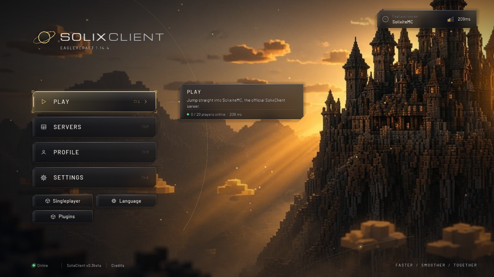

  

<h1 align="center">SolixClient</h1>

<b>Faster / Smoother / Together</b> &middot; a browser Minecraft client on Eaglercraft 1.14.4

SolixClient is Minecraft in your browser with a fully redesigned **tactical glass** UI, swappable themes with parallax
and particles, and a plugin system with a drag-and-drop HUD editor. You don't need to install anything. Open it and play.

## Play now

* **JavaScript build** (works everywhere): https://solix-client.vercel.app/js/
* **WASM-GC build** (faster, needs WebAssembly JSPI, e.g. Chrome 137+): https://solix-client.vercel.app/wasm/

* **Older versions:** https://solix-client.vercel.app/versions/ (each release stays playable, e.g. `/v0.3beta/js/`)

**Featured server:** `play.solxc.tech` (SolixiteMC, the official SolixClient server; it's the **Play** button on the main menu)

## Offline download

Always-latest direct links:
[SolixClient-js.html](https://github.com/eaglercraft-clients/solix-client-public/releases/download/v0.3beta/SolixClient-js.html) ·
[SolixClient-wasm.html](https://github.com/eaglercraft-clients/solix-client-public/releases/download/v0.3beta/SolixClient-wasm.html) ·
[solix-plugins.solixplugin.zip](https://github.com/eaglercraft-clients/solix-client-public/releases/download/v0.3beta/solix-plugins.solixplugin.zip).
The same HTML files are also in [`download/`](download/) in this repo. Or browse [Releases](../../releases):

| File | What it is |
| --- | --- |
| `SolixClient-v0.3beta-js.html` | The whole client in one HTML file. Save it and open it in any browser. |
| `SolixClient-v0.3beta-wasm.html` | The faster WASM-GC build in one file (needs JSPI, e.g. Chrome 137+). |
| `solix-plugins-v0.3beta.solixplugin.zip` | Every bundled plugin pack in one zip. |
| `SolixClient-js.html`, `SolixClient-wasm.html`, `solix-plugins.solixplugin.zip` | The same files under stable names, always the latest. |
| `*.solixplugin` | The same packs as individual files. |

## Installing plugins

The bundled packs (9 examples and 20 PvP packs) already ship inside the client:

1. On the main menu, open **Plugins**.
2. Find a pack (the search box helps), click **INSTALL** and confirm. Installing also enables it.
3. Open **HUD Layout** (on the Plugins or pause screen) to drag HUD elements where you want them. Press **R** to reset.

Installing a pack from a file:

1. Download a `.solixplugin` file from the release, or unzip `solix-plugins-v0.3beta.solixplugin.zip` and pick one.
2. Click **Plugins > Install File** and choose it. Released packs are encrypted, and the client handles that for you.

Plugins run isolated from the game, but that isn't a security sandbox. Only install packs you trust.

---
SolixClient is an unofficial client built on Eaglercraft. It isn't affiliated with Mojang or Microsoft. This repo only
holds releases.
